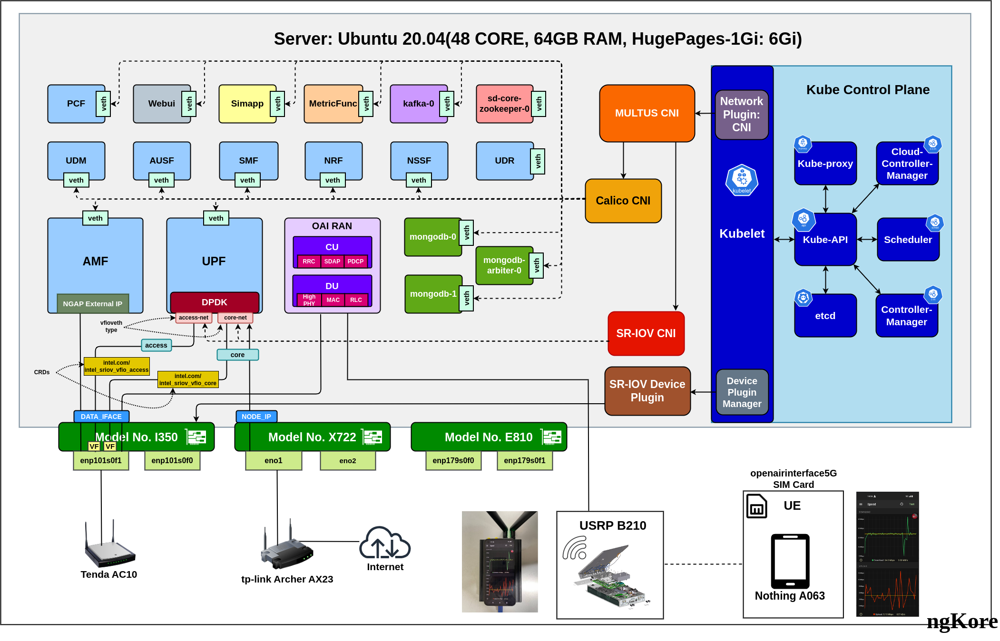
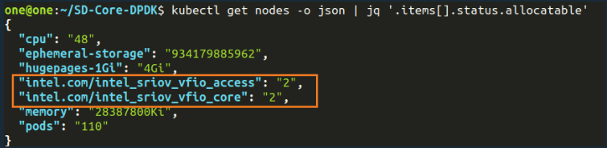
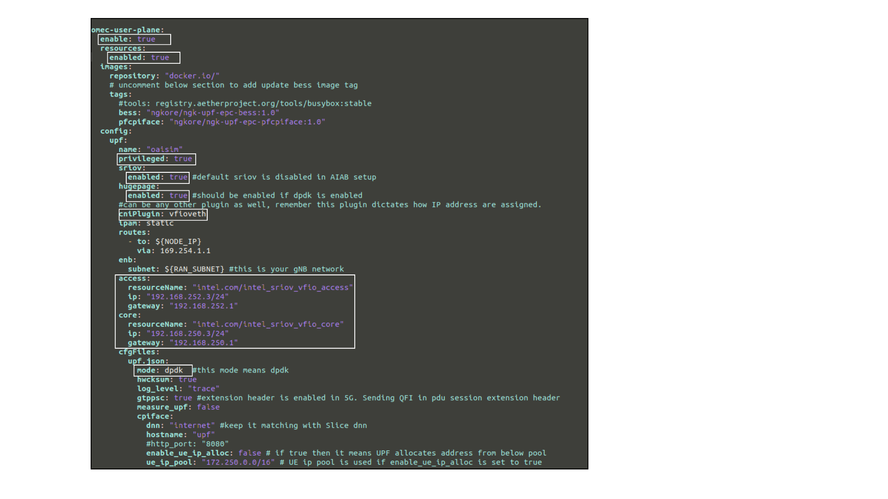

# SD-Core_DPDK_SR-IOV
## Pre-requisite:

-  As a pre-requisite please make sure `sriov`, `virtualization` and `VT-d` parameters are enabled in `BIOS`.
- Make sure enough `hugepage` memory allocated, `iommu` enabled. These changes can be made by updating
  below parameter in `/etc/default/grub` as follows:

```bash
vim /etc/default/grub
GRUB_CMDLINE_LINUX="intel_iommu=on iommu=pt default_hugepagesz=1G hugepagesz=1G hugepages=4 transparent_hugepage=never"
```

> **NOTE:** Make sure to give enough `HugePages` according to your requirement.

Once it is updated apply the changes by running below command,

```bash
sudo update-grub
sudo reboot
```

You can verify the allocated hugepages using below command:

```bash
cat /proc/meminfo | grep HugePages
```

### Network-Architecture Info:
- Two different routers are used. 
  - One is used for the `DATA_IFACE` and RAN (does not have internet connection)
  - The other router is used for `NODE_IP` (has internet connection)
- Server-1 us used in this deployment, `NIC i350` support SR-IOV
  - i350 NIC specs
  ```text
  <!-- $ ethtool -i ens2f1 -->
  driver: igb
  version: 5.6.0-k
  firmware-version: 1.63, 0x800009fb, 1.1747.0
  expansion-rom-version: 
  bus-info: 0000:65:00.1
  supports-statistics: yes
  supports-test: yes
  supports-eeprom-access: yes
  supports-register-dump: yes
  supports-priv-flags: yes
  ```

- Virtual Functions are only made at `DATA_IFACE` and attached to both access and core interface.


### According to the Diagram:
- `eno1` --> `NODE_IP` --> Internet
- `enp101s0f1` --> `DATA_IFACE` --> No Internet --> For this readme, I am considering this as `ens2f1`

> **NOTE:** The interface names will vary from system to system and NIC to NIC.


## Deployment

1. Firstly clone this repo:

```bash
git clone https://github.com/NgKore47/SD-Core-DPDK.git
```
2. Then clone the sd-core-helm-charts and untar it:

```bash
cd ~/
git clone https://github.com/NgKore47/sdcore-helm-charts.git
tar -xvzf ~/sdcore-helm-charts/cord.tar
```

3. Create SR-IOV Virtual Functions using the below command:

```bash
sudo su
echo 4 > /sys/class/net/ens2f1/device/sriov_numvfs
exit
```
##### Also provide manual MAC address to these VFs:

```bash
sudo ip link set ens2f1 vf 0 mac 00:11:22:33:44:66
sudo ip link set ens2f1 vf 1 mac 00:11:22:33:44:77
sudo ip link set ens2f1 vf 2 mac 00:11:22:33:44:88
sudo ip link set ens2f1 vf 3 mac 00:11:22:33:44:99
```

> **NOTE:** `ens2f1` is `DATA_IFACE` --> No Internet

> Refer [here](https://github.com/NgKore47/Documentation/raw/main/SD-Core_DPDK_SR-IOV/SetupSR_IOV.sh) for more details about creating SR-IOV Virtual Functions


4. To setup DPDK, directory run the script:

```bash
cd ~/SD-Core-DPDK
sudo ./dpdk-install/SetupDPDK.sh
```

> Refer [here](./dpdk-install/SetupDPDK.sh) for `SetupDPDK.sh` file


5. Bind the VF devices to the vfio-pci driver as follows:

> **NOTE:** You can also use `./dpdk-install/dpdk.py -s` or `dpdk-devbind.py -s` cmd to check PCI_ID of VFs

##### Binding VFs with pic-id:

```bash
./dpdk-install/dpdk.py -b vfio-pci 0000:65:10.1 #<pci-id of vf0>
./dpdk-install/dpdk.py -b vfio-pci 0000:65:10.5 #<pci-id of vf1>
./dpdk-install/dpdk.py -b vfio-pci 0000:65:11.1 #<pci-id of vf2>
./dpdk-install/dpdk.py -b vfio-pci 0000:65:11.5 #<pci-id of vf3>
```

6. Sriov plugin installation

##### Before installing sriov plugin, let's prepare the cluster:

```bash
vim sd-core-5g-values.yaml
# Update the amf: ExternalIP with --> <IP_of_eno1> -- > NODE_IP
make node-prep
```

##### Now install sriov plugin:

```bash
kubectl apply -f ./sriov/sriov-device-plugin.yaml
```

> **NOTE:** Change the `./sriov/sriov-device-plugin-config.yaml` according to the `pci-id` of the virtual functions.

After that:

```bash
kubectl apply -f ./sriov/sriov-device-plugin-config.yaml
```

##### Make sure that there are more than 2 intel_sriov_vfio resources available

```bash
kubectl get nodes -o json | jq '.items[].status.allocatable'
```
- Wait until it shows output like this: 


7. Pull Ngkore private docker images using:

```bash
kubectl create secret docker-registry regcred --docker-server=https://index.docker.io/v1/ --docker-username=ngkore --docker-password=dckr_pat_3aEGHh5fOR7GYqCc9gB0_rvt5aw --docker-email=ngkore47@gmail.com
kubectl create -f ~/sdcore-helm-charts/private-docker-images.yml
```
> **Note:** After this step, wait for a few minutes to pull the private images, wait until pod shows:
```text
default              ngkore-private-reg                                      0/15    CrashLoopBackOff
```

8. Now deply the 5G-Core using the Makefile:

```bash
ENABLE_GNBSIM=false DATA_IFACE=ens2f1 CHARTS=local make 5g-core
```
> **NOTE:** DATA_IFACE --> make sure to change it according to system.

9. To enable `POSTROUTING`, run the following command:
- After all the pods are up and running:

```bash
sudo iptables -t nat -A POSTROUTING -o eno1 -j MASQUERADE
```
> **NOTE:** Here, `eno1 = Node IP`.
> The above is required to run `internet` on `UE`

#####  In SD-Core with `DPDK` and `SR-IOV`, we did these changes:

- `~/SD-Core-DPDK/sd-core-5g-values.yaml`

	- use external IP for `AMF` --> same as `Node_IP`
	- In the `plmn`, change the `mcc`, `mnc` as shown below, this part is very important.
	- Enable `SR-IOV` and `hugepages`
	- Change `access` and `core` interface IPs according to core
	- Change mode to `DPDK`

This is the modified part of upf in `sd-core-5g-values.yaml`



> **NOTE:** Here is the list of all the changes that needs to be done on fresh SD-Core with DPDK and SR-IOV: [Click Here](./docs/sdcore_dpdk_gitdiff.patch)
> You can also checkout the logs of earlier deployment: [here](./docs/logs/) and `upf.json` [here](./docs/upf.json)

